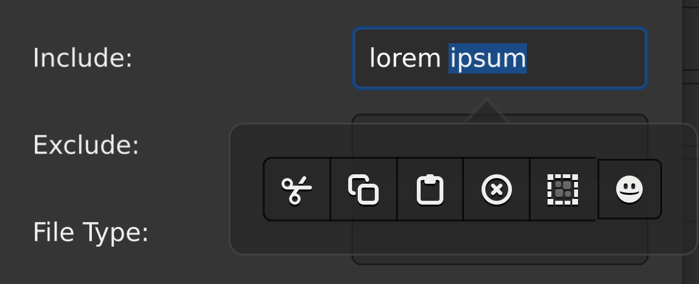
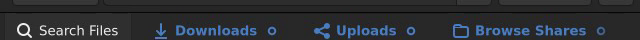

# Input & interaction

Stock Broadway treats a touchscreen as a mouse, so GTK's touch UI never appears and many taps drop. The fork sources real touchscreen events and makes touch first-class, then layers on pinch-zoom, touch-aware widgets, a live mouse cursor, clipboard and link bridging, and a set of pointer-interaction fixes.

## Touch text editing

- **Touch text editing** - selection handles and the Cut/Copy/Paste bubble.
- **On-screen keyboard** shows and hides on Android.
- **Touch text input** including non-Latin and IME.
- **Tap to dismiss** popover, menu, or selection bubble.
- **Gestures survive repaints** - a scroll or drag keeps working after the UI re-renders.
- **No spurious hover** styling or tooltips on a tap.

### Touch bugfixes

- The selection bubble's Cut/Copy/Paste fire, instead of the bubble being dismissed first.
- Menus and dropdowns no longer freeze on tap.
- Dropdowns select the row you tapped, not always the first.
- No crash when reopening the selection bubble.
- Copy reappears in the bubble after Select-All.
- Taps on Android Chrome no longer leave a stuck touch grab.
- Backspace and Delete work from the Android OSK.
- A tap can't activate a widget beneath an open popup.
- The bubble dismisses when a tap collapses the selection, and a handle drag can't empty it.
- Tapping an already-selected row in a multi-select list collapses the selection to it on release.

> Device sourcing, passive-listener/`touchcancel` handling, OSK/IME plumbing, popover/menu/dropdown fixes: [Touch implementation](../internals/touch.md).

## Pinch to zoom {#pinch-to-zoom}

Two-finger pinch zooms the whole UI (0.25x-5x) with a real re-layout and re-render, not a stretched bitmap.

- **Two-finger pinch** re-renders the whole UI crisply at the new scale.
- **Floating** - the magnified view follows the fingers and sharpens once they lift.
- **Per-client** - zoom is local to each browser. Ctrl+scroll on desktop zooms the app too (Firefox natively; Chromium/Safari driven by the fork).
- **Persists** across a page refresh - remembered per origin.

The first tap can leak into a pinch when a second finger lands; the pinch state machine suppresses the worst case but not all of it. See [Known issues](../guide/troubleshooting.md#known-issues).

> Reflow, live preview, coordinate remap, and tap-leak suppression: [Pinch zoom implementation](../internals/zoom.md).

## Widgets

Per-widget touch behavior, each gated to the Broadway backend.

### Notebook tabs {#notebook-tabs}

On Broadway the `GtkNotebook` tab bar becomes a single **pixel-scrolled** strip, closing the long-standing "tab bar not scrollable on touch" gap.

<video src="../images/notebook-tab-scroll.mp4" poster="../images/notebook-tab-scroll.png"
  autoplay loop muted playsinline style="max-width:100%;border-radius:6px">
  
</video>

*Touch-swiping the overflowing tab strip: tabs pixel-scroll to reveal the off-screen ones, fading at the edges. (Amber dots trace the swipe.)*

- **Drag the strip to scroll it** on touch, pixel-for-pixel without changing the page. A plain tap still selects a tab.
- **Position persists** - the strip stays where you left it.
- **Tab widths stay natural** - no stretch-to-fill, no jump as you drag.
- **Edge fades** hint at more tabs off-screen, instead of scroll arrows.
- **Wheel over the strip** pans horizontally; a vertical wheel switches the page and scrolls the new tab into view.
- **Touch reorder and detach still work** when the strip doesn't overflow.
- **Mouse is untouched** - desktop reorder and click stay stock.

> App-side note: an app can disable tab *reordering* under Broadway (`set_tab_reorderable`) so the native reorder-drag doesn't compete with the pan, and zero the header's horizontal padding so tabs reach the edge.

> Pixel-scroll model, layout, edge fades, and tap-vs-pan detection: [Notebook implementation](../internals/notebook.md).

### Labels

A selectable read-only `GtkLabel` normally has no touch selection UI. The fork gives it the same affordances as a text entry: **selection handles** and a **Copy / Select-all bubble**.

- Long-press to start a selection, then drag the handles - a drag always keeps at least one character selected.
- The bubble offers **Copy** and **Select all**; tapping outside, or collapsing the selection to a caret, dismisses it.
- Selection and handles tear down cleanly when the label loses the PRIMARY selection or is re-rooted.

It reuses the selection-bubble and handle machinery from Touch text editing above.

### Drop-downs

A tap on an open `GtkDropDown` list selects the **row you tapped** - stock Broadway's pointer-emulated touch landed every tap on the first item.

### Tree views

The deprecated `GtkTreeView` (still used by some apps) gets its touch multi-selection aligned with the mouse:

- Pressing a row of a multi-row selection **keeps** the whole selection instead of collapsing to that row.
- Tapping **empty space** clears the selection.
- Tapping one row of a multi-selection **collapses to it on release**.

## Dynamic cursor {#dynamic-cursor}

*New in v3*

Stock Broadway always showed the browser's default arrow. The fork forwards GTK's per-surface cursor to the browser, so the mouse pointer matches what's under it - most visibly the resize arrows at a window's edges.

- **Resize edges** show the matching resize cursor (`*-resize`).
- **Text fields** show the I-beam (`text`).
- **Links** show the hand (`pointer`).
- Anything else GTK asks for by name (grab, wait, crosshair, not-allowed, ...) maps straight through.

It applies to every surface (toplevels, dialogs, popups, menus), and mirrors GTK's cursor *intent* onto the browser's CSS `cursor`. So only **named** cursors map (a custom image cursor falls back to the default arrow), the glyph/theme/hotspot are the **browser's** OS cursor for that keyword, and touch never sends a cursor.

> The `BROADWAY_OP_SET_CURSOR` op, name-to-CSS mapping, and daemon dedup: [Dynamic cursor implementation](../internals/cursor.md).

## Desktop interaction

Pointer fixes that aren't touch-specific:

- **Horizontal two-finger swipe scrolls** instead of triggering the browser's back/forward navigation.
- **Drags survive the cursor leaving the widget** (e.g. a scrollbar drag continues when the pointer moves off it).
- **No crash when starting a drag from a text selection.**
- **Clicking empty space in a list clears the selection.**

## Desktop text input {#desktop-text-input}

Compose-key sequences (`Compose a '` -> á) reach the app. Dead keys and desktop IME (ibus/fcitx) take the same path but are untested - [reports welcome](https://github.com/droserasprout/gtk-brotway/issues).

## Clipboard {#clipboard}

Brotway bridges `GdkClipboard` <-> `gtk4-broadwayd` <-> the browser's `navigator.clipboard`, in both directions. No permission prompt shown in browser.

- **Copy / cut from the app** to the browser - Ctrl+C/X, right-click Copy, and custom Copy actions.
- **Paste into the app** from the browser - Ctrl+V, right-click Paste, and paste from the on-screen keyboard.
- **Multi-client safe** - with several browsers connected, a paste reply reaches the tab that asked, and a paste never hangs if a tab closes mid-request.
- Text up to 16 MiB.

### Limitations {#clipboard-limitations}

- **PRIMARY selection / middle-click paste** are not supported - browsers expose no JS API for it.
- **Text only.** No image or rich-clipboard support; the read path rejects non-text.
- `navigator.clipboard` needs a [secure context](../guide/running.md#secure-context-note): over plain `http://`, copy may silently fail outside a user gesture. Serve over `https://` or `http://localhost`.

> Wire paths and internals: [Clipboard implementation](../internals/clipboard.md).

## Opening links {#opening-links}

Clicking a link in a headless Broadway container did nothing - there's no system URI handler. The fork routes the URI over the Broadway protocol to the browser viewing the WebUI, which opens it in a new tab.

- **Clicked links open in a new browser tab** - the one viewing the app.
- Covers the standard GTK link paths: `gtk_show_uri`, `GtkUriLauncher.launch`, and `GtkLabel` / `GtkLinkButton` auto-link activation.
- An app's own URI-opening helper can add a `GDK_BACKEND == "broadway"` branch that calls `Gtk.show_uri(None, uri, 0)` before the GIO path, falling back gracefully on unpatched GTK.

Two caveats: it runs in the WebSocket message handler, not a user gesture, so a popup blocker may catch it; and `file://` URIs route too, but browsers block `window.open("file://...")` from an http(s) origin.

> The `BROADWAY_OP_OPEN_URI` op, wire path, and introspection workaround: [Open URI implementation](../internals/open-uri.md).
