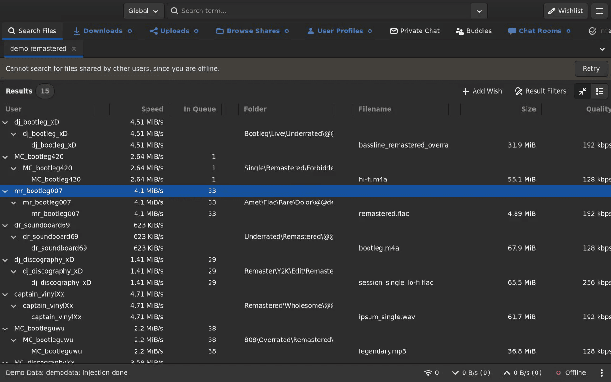

# Touch interface

<video src="../images/touch.mp4" poster="../images/touch.png"
  autoplay loop muted playsinline style="max-width:100%;border-radius:6px">
  
</video>

Stock Broadway treats a touchscreen as a mouse, so GTK's touch text-editing UI never appears and many taps get dropped. The fork sources real touchscreen events and makes touch a first-class input. Most of it was root-caused live on Android (Firefox over USB, HTTPS).

## What works

- **Touch text editing** - selection handles and the Cut/Copy/Paste bubble that GTK normally hides on Broadway.
- **Reliable taps** - the browser no longer cancels jittery or quick taps.
- **On-screen keyboard** shows and hides on Android, with no one-gesture lag.
- **Text input from touch**, including non-Latin and IME (Cyrillic, CJK, gesture-typing, autocorrect replacements, dead keys).
- **Tap outside** a popover, menu, or selection bubble to dismiss it.
- **Gestures survive repaints** - a scroll or drag keeps working after the UI re-renders.
- **No spurious hover** styling or tooltips on a tap.
- Cursor and selection handles don't block taps behind them (see [Input region](../internals/input-region.md)).

## Touch bugfixes

- The selection bubble's Cut/Copy/Paste fire, instead of the bubble being dismissed first.
- Menus and dropdowns no longer freeze on tap.
- Dropdowns select the row you tapped, not always the first.
- No crash when reopening the selection bubble.
- Copy reappears in the bubble after Select-All.
- Taps on Android Chrome no longer leave a stuck touch grab - begin and end now send the same remapped touch id.
- Backspace and Delete work from the Android OSK (GBoard reports them only as `beforeinput`).
- A tap can't activate a widget beneath an open popup - touch follows the pointer grab now.
- The bubble dismisses when a tap collapses the selection, and a handle drag can't empty it (keeps one character, like GtkText).
- Tapping an already-selected row in a multi-select list collapses the selection to it on release.

## Limitations

- The first tap can leak into a pinch or pan when a second finger lands; no fix yet without adding input latency. See [pinch zoom implementation](../internals/zoom.md#no-tap-leak-on-pinch) for the related zoom case.
- The emoji widget is slow and ugly over Broadway.

> The per-fix mechanics - sourcing the touchscreen device, passive-listener and `touchcancel` handling, OSK/IME plumbing, the popover/menu/dropdown fixes - are in [Touch implementation](../internals/touch.md).
