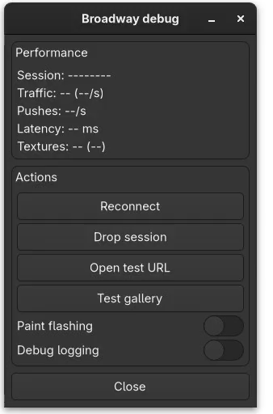

# Debug menu

*New in v2.1*

A **Triple-Shift** (press Shift three times quickly) summons a server-side debug overlay for the Broadway session: live stats, a paint-flash traffic profiler, and session actions. This is a native GTK4 window composited into the same display the main app uses.

> The menu binary (`gtk4-broadway-debugmenu`) is **local-dev only** - the `.deb` packs just `libgtk-4.so` and `gtk4-broadwayd` ([CI & packaging](../build/ci.md)); `Dockerfile.local` installs the menu on top for development.

## Performance section

This section shows Session id, Traffic (total bytes), Framerate, Latency, and Textures. **Latency** is the real browser-to-daemon round-trip: the client times its [heartbeat](../features/connection.md) PING/PONG and reports the last RTT in the next PING payload (`server->last_latency_ms`). **Textures** is the live texture buffer the browser holds (count plus summed PNG bytes across `server->textures`), the footprint kept warm by the [content texture cache](performance.md), with the per-second **upload** and **release** rates. `up/s` is every `broadway_server_upload_texture`, i.e. the client's content-cache *miss* rate (hits never cross the wire); sustained `up/s` on a static screen means the cache is thrashing.

## Smoothness section

Frame-pacing under load, since average FPS hides stutter. **Frame** is the p95 / max gap between real display pushes over a rolling 64-frame ring; gaps over 250 ms are treated as idle and dropped so the numbers reflect continuous rendering, not lulls. **Write** is the time blocked in the socket `writev` (≈0 on localhost; spikes = browser/network backpressure), plus bytes-per-frame. Note the debug menu repaints itself, so an idle reading is its own ~2/s noise floor - read these under load.

## Screen section

Pins the browser's logical screen **Width × Height × Scale** (integer scale only - Broadway monitors are not fractional), overriding the live window size and `devicePixelRatio`; **Reset** unpins. The daemon sends `BROADWAY_OP_DEBUG_SET_SCREEN` (25) and `broadway.js` drives its normal resize path with the pinned values, so the canvas rebuilds cleanly (no blank-until-zoom) and the app re-lays-out at the forced size. Useful for reproducing a device's geometry/HiDPI from a desktop browser.

## Actions

- **Reconnect** closes the browser's socket so its auto-reconnect resumes in place, token unchanged.
- **Drop session** rolls the session token first, so the reconnecting client sees a new session and hard-resets.
- **Open test URL** exercises the [open-uri](../features/open-uri.md) path.
- **Test gallery** opens the [widget gallery](#widget-gallery) below.
- **Paint flashing** toggles the profiler below.
- **Debug logging** is a placeholder, no-op for now.

## Widget gallery

**Test gallery** opens a second top-level window holding one clean, empty widget per fork feature. It gives any Broadway session - including a real Android device - a stable, data-free surface to exercise and screencast a feature, instead of hunting for the right widget inside a live app at app-specific coordinates.

| Section | Widgets | Exercises |
|---|---|---|
| Text & clipboard | two `GtkEntry`, a selectable `GtkLabel`, a `GtkTextView` | [clipboard](../features/clipboard.md), [touch text selection](../features/touch.md), OSK/IME |
| Notebook tabs | a scrollable `GtkNotebook` with more tabs than fit | [tab pixel-scroll](../features/notebook.md) |
| Menus & popups | `GtkDropDown`, a popover, an "Open dialog" button | [tap-selects-right-row, menu-tap freeze](../features/touch.md), autohide popovers, window centering |
| Scrolling list | a `GtkListBox` of 25 rows in a scroller | gesture-survives-repaint, hover prelight, [node/texture reuse](performance.md) |
| Animation & links | a `GtkSpinner`, a `GtkSwitch`, a `GtkLinkButton` | continuous-repaint traffic, [open-uri](../features/open-uri.md) |

The menu and the windows it opens share one main loop, but it quits only when the **last** window closes - so you can close the stats overlay and keep just the gallery up for a clean recording. Escape or Close dismisses whichever window has focus.

**Stacking.** `broadwayd` pins every toplevel owned by the debug-menu client (the stats overlay, the gallery, the test dialog) above the app's windows, with the most recently mapped one on top - so opening the gallery floats it over the overlay, and the dialog floats over both (`menu_owner` / `restack_menu_on_top` in `broadway-server.c`). Closing the stats overlay while the gallery stays open used to crash the menu: the control channel kept writing stats into the overlay's freed labels. The labels are now cleared on overlay close and the stats source torn down.

## Paint-flash profiler

With Paint flashing on, every changed node gets a translucent overlay so you can *see* Broadway's upload traffic, coloured by cost:

- **green**: node and texture reused (no work)
- **magenta**: node re-sent but its texture was cached (cheap)
- **red**: texture uploaded this frame (real bandwidth)

The daemon sends `BROADWAY_OP_DEBUG_FLASH` (24) to toggle it; the client tags each node as it is applied. Overlays are pooled and drawn in one read-then-write pass with a single recycle timer per frame. An earlier per-node implementation (one `getBoundingClientRect` + `appendChild` + `setTimeout` each) thrashed layout and froze the page under heavy scrolling.

## How it is wired

Triple-Shift in `broadway.js` sends `BROADWAY_EVENT_MENU` (17). `broadwayd` intercepts it and `spawn`s `gtk4-broadway-debugmenu` with `GDK_BACKEND`/`BROADWAY_DISPLAY` pointed at itself, so the window renders into the same display and is pinned always-on-top via server-side stacking.

The daemon hands the child one end of a control socketpair through the `BROADWAY_DEBUGMENU_FD` env var. Over it the daemon pushes a `stats` line (session, bytes, fps, latency, flash, tex count/bytes, then pacing: frame p95/max, write avg/max, bytes-per-frame, upload/s, release/s) every ~500 ms and reads back newline-terminated commands (`reconnect`, `drop-session`, `open-uri`, `paint-flash 0|1`, `screen W H S`). The menu has no Close button - the titlebar, Escape, and a second Triple-Shift all dismiss it.
