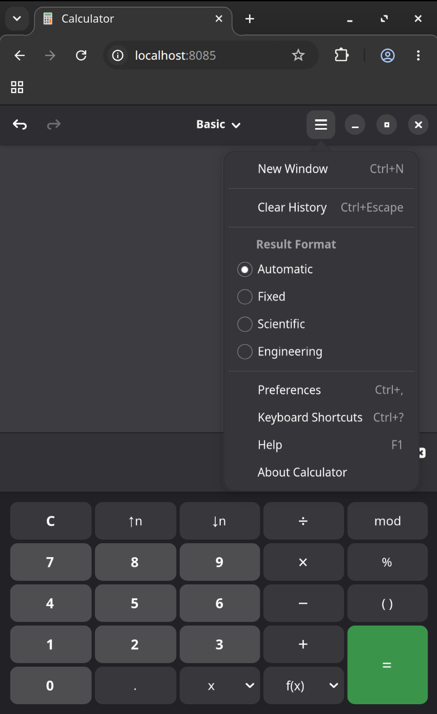

# Brotway, a GTK Broadway fork

Brotway is a fork of GTK that fills in the missing pieces of the Broadway backend, as a thin layer on stock GTK. It gives native GTK4 apps rendered in a browser tab a working clipboard, real touch, pinch-zoom, and in-place reconnect.

## What the fork adds

- **[Clipboard](features/input.md#clipboard):** copy/paste between app and browser, multi-client safe.
- **[Touch interface](features/input.md):** touch text editing, on-screen keyboard, IME and non-Latin input.
- **[Connection & sessions](features/connection.md):** in-place reconnect that survives screen-off and network handovers.
- **[Scaling & HiDPI](features/display.md#scaling-and-hidpi):** crisp icons under scale transforms.
- **[Pinch to zoom](features/input.md#pinch-to-zoom):** two-finger UI zoom that re-renders crisply.
- **[Notebook tabs](features/input.md#notebook-tabs):** drag/wheel scrolling of the tab strip on touch.
- **[Opening links](features/input.md#opening-links):** clicked links open in the viewing browser.
- **[Dynamic cursor](features/input.md#dynamic-cursor):** the browser pointer follows GTK's cursor shape.
- **[Tab title & favicon](features/display.md#tab-title-and-favicon):** the browser tab shows the app's title and icon.
- **[Display & rendering](features/display.md):** no white flash, centered windows, popups on their anchor, click-through shadows, seam-free borders.

## What is Broadway? {#broadway}

Broadway is GTK's HTML5 backend: instead of drawing to a local display (Wayland, X11, Win32, macOS), it renders the app into a web browser over a WebSocket. A `gtk4-broadwayd` daemon owns a virtual display and serves a page; any browser that connects sees and drives the running GTK app. No app code changes - the same binary picks Broadway through `GDK_BACKEND=broadway`. So a native GTK app can run on a screen it was never built for: a phone browser, a remote machine, a kiosk.

It started as Alexander Larsson's frame-streaming prototype ([2010](https://blogs.gnome.org/alexl/2010/11/26/gtk-3-0-html5-backend/), merged for GTK 3.2) and was [reworked around GTK4's render-node pipeline](https://blogs.gnome.org/alexl/2019/03/29/broadway-adventures-in-gtk4/): the GSK Broadway renderer turns render nodes into a compact stream the browser reconstructs in the DOM, rasterizing with cairo only what Broadway can't express. That node-stream design is what the fork builds on ([Architecture](internals/architecture.md)).

Broadway stayed an experimental, lightly-maintained corner of GTK, and in February 2025 was [deprecated alongside X11](https://www.phoronix.com/news/GTK-X11-Now-Deprecated) (stable 4.18), to be removed entirely in GTK5. There is no GTK5 Broadway to move to, so the fork is anchored to the GTK 4.x lifetime.

## Project goals

- **Thin layer on GTK4.** Patches touch only the Broadway backend, never app-facing API, so each point release re-forks with a minimal diff. The fork lives only as long as GTK4.
- **Accurate rendering.** The browser matches what the app draws: correct scaling, no white flash, no stretched bitmaps, crisp HiDPI and zoom.
- **Any browser, any device.** Touch and mobile are primary targets; touch text editing, the OSK, IME, and pinch-zoom work as well as mouse and keyboard.
- **Match the GNOME/Mutter experience.** A Broadway session behaves like a real compositor, not a degraded remote view.
- **Stable.** No crashes, wedged input, or dropped sessions; reconnect in place.
